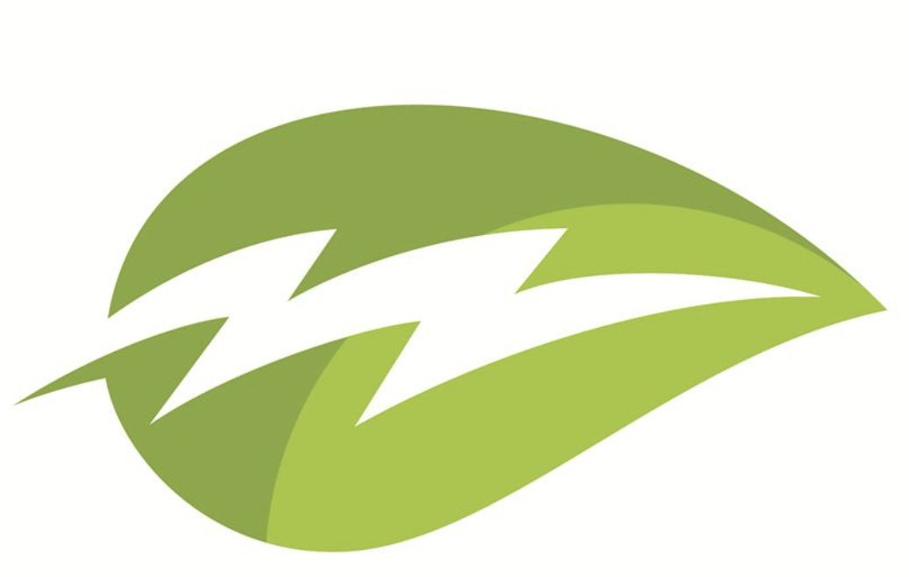

<h1 align="left">🖲️ Furion</h1>

  
  
  
  

### 🏠 [Homepage](https://github.com/gnahZ-eH/Furion)

## Author

👤 **He Zhang(Joe)**

* zhihu: [@https://www.zhihu.com/people/Jerry_Zhang](https://twitter.com/https://www.zhihu.com/people/Jerry_Zhang)
* Github: [@gnahZ-eH](https://github.com/gnahZ-eH)

## 🤝 Contributing

Contributions, issues and feature requests are welcome! Feel free to check [issues page](https://github.com/gnahZ-eH/Furion/issues).

## Show your support

Give a ⭐️ if this project helped you!

## 📝 License

Copyright © 2019 [He Zhang(Joe)](https://github.com/gnahZ-eH). 
This project is [MIT](https://github.com/gnahZ-eH/Furion/blob/master/LICENSE) licensed.

***
_This README was generated with ❤️ by [readme-md-generator](https://github.com/kefranabg/readme-md-generator)_
